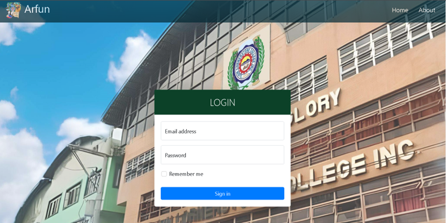
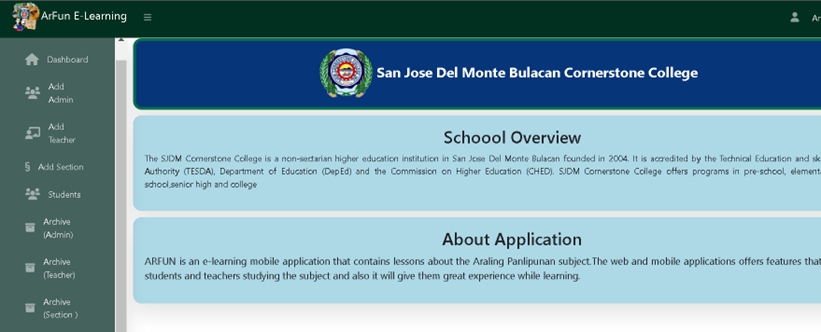

# ARFUN: An Araling Panlipunan Focused E-Learning Mobile Application (Admin Dashboard) 

## 🧙 Technical Adviser:

- Jennifer Anne Repaso - Ideation, UI and UX
  
## 🙋‍Contributors:

- Adrian Gaile P. Singh - Web Development - Bulacan State University
- Joy Desales - Web Development - Bulacan State University
- Zian Jolo Catacutan - Web Development - Bulacan State University
- Sabdren Troy Milante - Web Development - Bulacan State University
- Kurt Russel Francisco - Mobile Development - Bulacan State University
- Ronaldo Abacial - Mobile Development - Bulacan State University
  
## 🍿Description :

Our project is an E-Learning mobile application focused on the Araling Panlipunan subject for Grade 6 students at San Jose del Monte Cornerstone 
College, Inc. It aims to provide a learning tool that will help students to learn the Araling Panlipunan subject, to provide students and teachers with 
easier access to the Araling Panlipunan module by using the **web** and **mobile application**

## 💻 ARFUN: Admin Dasboard

**Screenshots:**

For more screenshot, please check [this]() and fore [demo]().

## ✨Features:

**Admin**
- Add Admin/Teacher/Section to the web app

**Teacher**
- Add students to a section
- Archive dropped student
- Download student list
- Create quiz
- View student quiz score

**Technologies Used:**
- PHP 
- JavaScript
- Google Firebase
